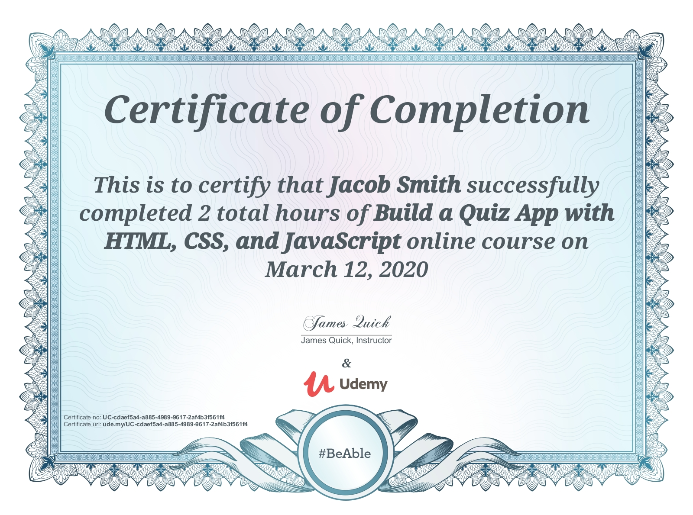

# Build a Quiz App with HTML, CSS, and JavaScript
> My completion of the popular course by [James Quick](https://github.com/jamesqquick/).

## Lectures

1. [Create and Style the Home Page](https://github.com/itsnewt/Build-A-Quiz-App-With-HTML-CSS-and-JavaScript/tree/master/Lecture%201.%20Create%20and%20Style%20the%20Home%20Page)
2. [Create and Style the Game Page](https://github.com/itsnewt/Build-A-Quiz-App-With-HTML-CSS-and-JavaScript/tree/master/Lecture%202.%20Create%20and%20Style%20the%20Game%20Page)
3. [Display Hard Coded Questions and Answers](https://github.com/itsnewt/Build-A-Quiz-App-With-HTML-CSS-and-JavaScript/tree/master/Lecture%203.%20Display%20Hard%20Coded%20Questions%20and%20Answers)
4. [Display Feedback for Correct/Incorrect Answers](https://github.com/itsnewt/Build-A-Quiz-App-With-HTML-CSS-and-JavaScript/tree/master/Lecture%204.%20Display%20Feedback%20for%20Correct%20or%20Incorrect%20Answers)
5. [Create Head's Up Display (HUD)](https://github.com/itsnewt/Build-A-Quiz-App-With-HTML-CSS-and-JavaScript/tree/master/Lecture%205.%20Create%20Head's%20Up%20Display%20(HUD))
6. [Create a Progress Bar](https://github.com/itsnewt/Build-A-Quiz-App-With-HTML-CSS-and-JavaScript/tree/master/Lecture%206.%20Create%20a%20Progress%20Bar)
7. [Create and Style the End Page](https://github.com/itsnewt/Build-A-Quiz-App-With-HTML-CSS-and-JavaScript/tree/master/Lecture%207.%20Create%20and%20Style%20the%20End%20Page)
8. [Save High Scores in Local Storage](https://github.com/itsnewt/Build-A-Quiz-App-With-HTML-CSS-and-JavaScript/tree/master/Lecture%208.%20Save%20High%20Scores%20in%20Local%20Storage)
9. [Load and Display High Scores from Local Storage](https://github.com/itsnewt/Build-A-Quiz-App-With-HTML-CSS-and-JavaScript/tree/master/Lecture%209.%20Load%20and%20Display%20High%20Scores%20from%20Local%20Storage)
10. [Fetch API to Load Questions from Local JSON File](https://github.com/itsnewt/Build-A-Quiz-App-With-HTML-CSS-and-JavaScript/tree/master/Lecture%2010.%20Fetch%20API%20to%20Load%20Questions%20from%20Local%20JSON%20File)
11. [Fetch API to Load Questions from Open Trivia DB API](https://github.com/itsnewt/Build-A-Quiz-App-With-HTML-CSS-and-JavaScript/tree/master/Lecture%2011.%20Fetch%20API%20to%20Load%20Questions%20from%20Open%20Trivia%20DB%20API)
12. [Create a Spinning Loader](https://github.com/itsnewt/Build-A-Quiz-App-With-HTML-CSS-and-JavaScript/tree/master/Lecture%2012.%20Create%20a%20Spinning%20Loader)

I changed small bits of the code to fit my programming style more - such as using .querySelector instead of .getElementById

## Udemy Course Description

Want to improve your core Web Development skills? Want to improve your knowledge of HTML, CSS, and JavaScript? In this course, you're going to learn how to build a Quiz application without the assistance of libraries or frameworks. Here are some of the topic we will cover!

- Save high scores in Local Storage
- Create a progress bar
- Create a spinning loader icon
- Dynamically generate HTML in JavaScript
- Fetch trivia questions from Open Trivia DB API

**What you’ll learn**
- ES6 JavaScript features like arrow functions, the spread - operator, const and let, and template literal string
- how to use the Fetch API to load trivia questions from an API
- how to store high scores in Local Storage
- how to use Flexbox, Animations, and REM units in CSS
- how to create a progress bar from scratch
- how to create a spinning loader icon from scratch

**Are there any course requirements or prerequisites?**
- a text editor (Visual Studio Code suggested)
- Google Chrome browser
- an excitement to learn!

**Who this course is for:**
- Beginner or aspiring Web Developers looking to learn core Web Development skills
- Intermediate Web Developers looking to improve their core Web Development Skills
